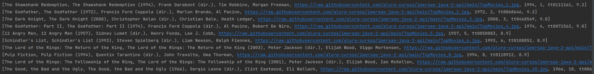

> **Using JAVA 11**

## Introduction

I'm study "imersão java" it's a little course at alura school, here i made some requests using API from <a href="https://imdb.com/">ImDb</a>.

**Tip**: use **[SDKMan](https://sdkman.io/jdks)** to download JDK.

- **Simple to Start**

> Clone this repository and build it.
> Now we have a stickers creator for whatsapp.

## Response

## License

This code is free [MIT licensed](./LICENSE).
  
